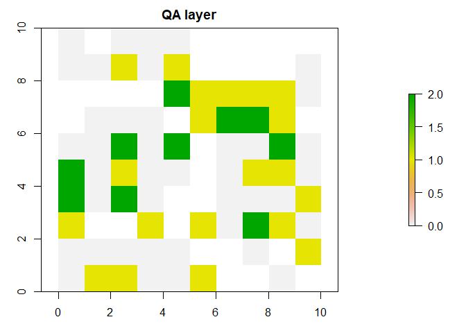

<!-- README.md is generated from README.Rmd. Please edit that file -->

# specdr

<!-- badges: start -->
<!-- badges: end -->

The goal of `specdr` is to assist you in detecting changes in spectral
time series. It implements a per-band version of the CCDC algorithm that
gives you more control over how change is detected, and it contains a
function to measure change magnitude in real and relative terms. In
addition, `specdr` also contains functions for the preparation of
spectral time series data, with a special focus on the Harmonized
Landsat Sentinel-2 datasets.

## Installation

You can install the development version of `specdr` from
GitHub:(<https://github.com>) with:

``` r
# install.packages("devtools")
devtools::install_github("gpeargin/specdr")
```

## Usage

Before performing change detection, you will likely want to preprocess
your data. A good first step is to mask clouds, snow/ice, and other
pixels that add noise to your data. If you are working with HLS data,
you can create a mask from an Fmask layer with `make.qa`. `make.qa` also
ranks unmasked pixels according to their aerosol level, which is useful
for compositing:

``` r
library(specdr)
#> Loading required package: terra
#> terra 1.7.3
data(fm_ex)
plot(fm_ex)
```


``` r

#QA layer with all categories masked
qa <- make.qa(fm_ex)
plot(qa)
```


``` r

#QA layer with cloud shadow and adjacent pixels retained
qa <- make.qa(fm_ex, keep = c("Cloud shadow", "Adjacent to cloud/shadow"))
plot(qa)
```


With `terra::mask`, you can set a raster’s values to `NA` wherever they
coincide with `NA` values in the corresponding QA layer. Masking,
however, does not guarantee that outliers will be set to `NA.` It is
good to remove any outliers after masking, before performing any
calculations with a raster’s values. `remove.outliers` lets you do just
that:

``` r
set.seed(1)
m <- matrix(rbinom(100, 10, 0.5), nrow = 10)
s <- sample(1:100, 5)
m[s] <- 100

r <- rast(m)
plot(r)
```


``` r

r <- remove.outliers(r)
plot(r)
```


Lastly, Earth observation data is often coerced into integer format to
reduce file sizes; when this is the case, the user is given a scale
factor to multiply or divide a band’s values by. If all rasters in your
time series are not of the same scale, those that are not properly
scaled will skew your time series. With `check.scale`, you can ensure
that all of your rasters are of the same order of magnitude:

``` r
set.seed(1)
m <- matrix(rnorm(100), nrow = 10)
r <- rast(m)
mean(values(r))
#> [1] 0.1088874

#check r for proper scale, rescale if needed
r <- check.scale(r, 10000, 1)
mean(values(r))
#> [1] 1088.874
```

However, you can also perform QA layer generation, masking, outlier
removal, and scaling with a single function, `mask.clean`:

``` r
#Load/create data
set.seed(1)
data(qa_ex)
r <- rast(matrix(rnorm(100), nrow = 10))

#Compare before and after `mask.clean`
mean(values(r))
#> [1] 0.1088874
plot(r, main = "Raster")
```


``` r
plot(qa_ex, main = "QA layer")
```



``` r
r <- mask.clean(r, qa_ex, "QA", 10000)
mean(values(r), na.rm = TRUE)
#> [1] 465.4195
plot(r, main = "Masked & Cleaned Raster")
```


If you are working with a single dataset, then in many instances, this
will be all the preprocessing you’ll need to do. If you are working with
HLS data and plan to use both the HLSL and HLSS datasets, though, it is
a good idea to make sure the time series for the two satellites aren’t
dramatically different from one another. With `align.sats`, you can make
the two time series have, on average, the same mean and variance:

``` r
#load data
data(rts_ex)
data(so_ex)

#before
avgs <- sapply(1:dim(rts_ex)[3], function(i) mean(rts_ex[,,i], na.rm = TRUE))
ggplot2::ggplot() +
ggplot2::geom_point(ggplot2::aes(x = 1:length(avgs), y = avgs, col = factor(so_ex)))
```


``` r

#after
rts_ex <- align.sats(rast(rts_ex), so_ex, c("HLSL","HLSS"))
avgs <- sapply(1:dim(rts_ex)[3], function(i) mean(rts_ex[,,i], na.rm = TRUE))
ggplot2::ggplot() +
ggplot2::geom_point(ggplot2::aes(x = 1:length(avgs), y = avgs, col = factor(so_ex)))
```


Be mindful of the possibility that some dates may have two observations,
one from each satellite. When this is the case, either one of the
observations should be discarded, or they should be composited into a
single image.

Moving on: now that you’ve preprocessed your data, your time series is
ready for change detection. `detect.change.harmonic` is `specdr`’s basic
call for individual time series, which is applied to all pixels in a
raster with `detect.change`. `detect.change.harmonic` follows the CCDC
algorithm put forth in Zhu, et al. (2014), with some modifications.

It fits a linear model with harmonic terms to an initial set of
observations, defined by a number of days specified by you. This model
is then used to predict the values of the series’ remaining
observations, which are flagged if their residuals exceed a threshold
value; you decide whether this value will be determined by the root mean
square error of the fitted observations’ residuals, their interquartile
range, or by a Z-score derived from their normal approximation.

If the fraction of flagged observations occurring within a specified
time frame exceeds a threshold percentage, a change will be considered
to have occurred at the earliest such time, and a new model will be fit;
the observations do not need to be consecutive. Optionally, you can set
a minimum percentage of flagged observations occurring in the first half
of the time window for change to be recorded. This can help you avoid
recording changes too early.

This process repeats until the end of the time series is reached, and a
list containing the dates of the changes, their index within the time
series, and the model coefficients is returned (note that the change
date and index for initial models are both `NA`). Here’s
`detect.change.harmonic` in action:

``` r
#load data
data(ts_ex)
data(tg_ex)

#changes are:
#1. tg_ex[101] (increase in mean)
#2. tg_ex[201] (decrease in mean)
plot(tg_ex, ts_ex)
```


``` r

#fit models
changes_rmse <- detect.change.harmonic(ts_ex, tg_ex)
changes_iqr <- detect.change.harmonic(ts_ex, tg_ex, flag.stat = "iqr")
changes_z <- detect.change.harmonic(ts_ex, tg_ex, flag.stat = "z")

#check results
print("RMSE")
#> [1] "RMSE"
changes_rmse
#> $change.dates
#> [1] NA           "2017-02-04"
#> 
#> $change.index
#> [1]  NA 101
#> 
#> $coefficients
#> $coefficients[[1]]
#>             (Intercept) sinpi(2/365 * t.Julian) cospi(2/365 * t.Julian) 
#>             0.163393136             0.948162462             0.982639919 
#>                t.Julian 
#>            -0.000274057 
#> 
#> $coefficients[[2]]
#>             (Intercept) sinpi(2/365 * t.Julian) cospi(2/365 * t.Julian) 
#>             5.569570856             0.920202870             1.422946966 
#>                t.Julian 
#>            -0.001021767
print("IQR")
#> [1] "IQR"
changes_iqr
#> $change.dates
#> [1] NA           "2017-02-04" "2018-03-11"
#> 
#> $change.index
#> [1]  NA 101 201
#> 
#> $coefficients
#> $coefficients[[1]]
#>             (Intercept) sinpi(2/365 * t.Julian) cospi(2/365 * t.Julian) 
#>             0.163393136             0.948162462             0.982639919 
#>                t.Julian 
#>            -0.000274057 
#> 
#> $coefficients[[2]]
#>             (Intercept) sinpi(2/365 * t.Julian) cospi(2/365 * t.Julian) 
#>             5.569570856             0.920202870             1.422946966 
#>                t.Julian 
#>            -0.001021767 
#> 
#> $coefficients[[3]]
#>             (Intercept) sinpi(2/365 * t.Julian) cospi(2/365 * t.Julian) 
#>            -3.059845084             0.989972892             1.385830762 
#>                t.Julian 
#>            -0.001967158
print("Z")
#> [1] "Z"
changes_z
#> $change.dates
#> [1] NA           "2017-02-04" "2018-03-11"
#> 
#> $change.index
#> [1]  NA 101 201
#> 
#> $coefficients
#> $coefficients[[1]]
#>             (Intercept) sinpi(2/365 * t.Julian) cospi(2/365 * t.Julian) 
#>             0.163393136             0.948162462             0.982639919 
#>                t.Julian 
#>            -0.000274057 
#> 
#> $coefficients[[2]]
#>             (Intercept) sinpi(2/365 * t.Julian) cospi(2/365 * t.Julian) 
#>             5.569570856             0.920202870             1.422946966 
#>                t.Julian 
#>            -0.001021767 
#> 
#> $coefficients[[3]]
#>             (Intercept) sinpi(2/365 * t.Julian) cospi(2/365 * t.Julian) 
#>            -3.059845084             0.989972892             1.385830762 
#>                t.Julian 
#>            -0.001967158
```

`detect.change` applies `detect.change.harmonic` to all pixels in a
raster time series. It pairs the index of the pixel’s position within
the raster with the output of `detect.change.harmonic`, adds these to a
list containing the changes for all pixels, and then provides a separate
list containing the spatial parameters of the raster:

``` r
#load data
data(arr_ex)
data(tg_ex)

#detect changes
cl_ex0 <- detect.change(rast(arr_ex), tg_ex, flag.stat = "iqr")
#> (-) [>------------------------------]   4% [Elapsed time: 00:00:00 || Estimated time remaining:  0s](\) [=>-----------------------------]   8% [Elapsed time: 00:00:00 || Estimated time remaining:  0s](|) [===>---------------------------]  12% [Elapsed time: 00:00:00 || Estimated time remaining:  1s](/) [====>--------------------------]  16% [Elapsed time: 00:00:00 || Estimated time remaining:  1s](-) [=====>-------------------------]  20% [Elapsed time: 00:00:00 || Estimated time remaining:  1s](\) [======>------------------------]  24% [Elapsed time: 00:00:00 || Estimated time remaining:  0s](|) [========>----------------------]  28% [Elapsed time: 00:00:00 || Estimated time remaining:  0s](/) [=========>---------------------]  32% [Elapsed time: 00:00:00 || Estimated time remaining:  0s](-) [==========>--------------------]  36% [Elapsed time: 00:00:00 || Estimated time remaining:  0s](\) [===========>-------------------]  40% [Elapsed time: 00:00:00 || Estimated time remaining:  0s](|) [=============>-----------------]  44% [Elapsed time: 00:00:00 || Estimated time remaining:  0s](/) [==============>----------------]  48% [Elapsed time: 00:00:00 || Estimated time remaining:  0s](-) [===============>---------------]  52% [Elapsed time: 00:00:00 || Estimated time remaining:  0s](\) [================>--------------]  56% [Elapsed time: 00:00:00 || Estimated time remaining:  0s](|) [==================>------------]  60% [Elapsed time: 00:00:00 || Estimated time remaining:  0s](/) [===================>-----------]  64% [Elapsed time: 00:00:00 || Estimated time remaining:  0s](-) [====================>----------]  68% [Elapsed time: 00:00:00 || Estimated time remaining:  0s](\) [=====================>---------]  72% [Elapsed time: 00:00:00 || Estimated time remaining:  0s](|) [=======================>-------]  76% [Elapsed time: 00:00:00 || Estimated time remaining:  0s](/) [========================>------]  80% [Elapsed time: 00:00:00 || Estimated time remaining:  0s](-) [=========================>-----]  84% [Elapsed time: 00:00:00 || Estimated time remaining:  0s](\) [==========================>----]  88% [Elapsed time: 00:00:00 || Estimated time remaining:  0s](|) [============================>--]  92% [Elapsed time: 00:00:00 || Estimated time remaining:  0s](/) [=============================>-]  96% [Elapsed time: 00:00:00 || Estimated time remaining:  0s](-) [===============================] 100% [Elapsed time: 00:00:00 || Estimated time remaining:  0s]
print("info")
#> [1] "info"
cl_ex0$info
#> $dim
#> [1] 5 5
#> 
#> $crs
#> [1] NA
#> 
#> $ext
#> xmin xmax ymin ymax 
#>    0    5    0    5 
#> 
#> $res
#> [1] 1 1
print("changes")
#> [1] "changes"
cl_ex0$changes[[1]]
#> $change.dates
#> [1] NA           "2017-02-04" "2018-03-11"
#> 
#> $change.index
#> [1]  NA 101 201
#> 
#> $coefficients
#> $coefficients[[1]]
#>             (Intercept) sinpi(2/365 * t.Julian) cospi(2/365 * t.Julian) 
#>             0.163393136             0.948162462             0.982639919 
#>                t.Julian 
#>            -0.000274057 
#> 
#> $coefficients[[2]]
#>             (Intercept) sinpi(2/365 * t.Julian) cospi(2/365 * t.Julian) 
#>             5.569570856             0.920202870             1.422946966 
#>                t.Julian 
#>            -0.001021767 
#> 
#> $coefficients[[3]]
#>             (Intercept) sinpi(2/365 * t.Julian) cospi(2/365 * t.Julian) 
#>            -3.059845084             0.989972892             1.385830762 
#>                t.Julian 
#>            -0.001967158 
#> 
#> 
#> $position
#> [1] 1
print(paste0("length: ", length(cl_ex0$changes)))
#> [1] "length: 25"
```

Now that you know where and when changes have occurred in your time
series, the last part of your `specdr` workflow will be to answer the
question, “how big are the changes I’ve found, and what are their
characteristics?” `measure.change` answers these questions by
calculating the real and relative differences between a (non-initial)
model’s coefficients and those of the preceding model. These are
appended to the output of `detect.change` for each pixel. List elements
corresponding to initial models are removed, as well as any changes
occurring outside a subset `t.sub`, if it is declared:

``` r
#load data
data(cl_ex)
data(tg_ex)

#measure change for whole period
mc_ex <- measure.change(cl_ex, tg_ex)
mc_ex[[1]]$dates
#> $From
#> [1] "2016-01-01"
#> 
#> $To
#> [1] "2019-04-11"
head(rlist::list.stack(mc_ex[[2]]))
#>   change.dates change.index
#> 1   2017-02-04          101
#> 2   2018-03-11          201
#> 3   2017-02-04          101
#> 4   2018-03-11          201
#> 5   2017-02-04          101
#> 6   2018-03-11          201
#>                                           coefficients position
#> 1  5.569570856, 0.920202870, 1.422946966, -0.001021767        1
#> 2 -3.059845084, 0.989972892, 1.385830762, -0.001967158        1
#> 3  5.569570856, 0.920202870, 1.422946966, -0.001021767        2
#> 4 -3.059845084, 0.989972892, 1.385830762, -0.001967158        2
#> 5  5.569570856, 0.920202870, 1.422946966, -0.001021767        3
#> 6 -3.059845084, 0.989972892, 1.385830762, -0.001967158        3
#>                                                   diff.raw
#> 1 5.4061777204, -0.0279595923, 0.4403070463, -0.0007477104
#> 2        -8.62941594, 0.06977002, -0.03711620, -0.00094539
#> 3 5.4061777204, -0.0279595923, 0.4403070463, -0.0007477104
#> 4        -8.62941594, 0.06977002, -0.03711620, -0.00094539
#> 5 5.4061777204, -0.0279595923, 0.4403070463, -0.0007477104
#> 6        -8.62941594, 0.06977002, -0.03711620, -0.00094539
#>                                           diff.pct
#> 1 33.08693295, -0.02948819, 0.44808585, 2.72830226
#> 2 -1.54938615, 0.07582026, -0.02608404, 0.92524970
#> 3 33.08693295, -0.02948819, 0.44808585, 2.72830226
#> 4 -1.54938615, 0.07582026, -0.02608404, 0.92524970
#> 5 33.08693295, -0.02948819, 0.44808585, 2.72830226
#> 6 -1.54938615, 0.07582026, -0.02608404, 0.92524970

#measure change for slice
mc_ex <- measure.change(cl_ex, tg_ex, c(50, 150))
mc_ex[[1]]$dates
#> $From
#> [1] "2016-07-15"
#> 
#> $To
#> [1] "2017-08-19"
head(rlist::list.stack(mc_ex[[2]]))
#>   change.dates change.index                                        coefficients
#> 1   2017-02-04          101 5.569570856, 0.920202870, 1.422946966, -0.001021767
#> 2   2017-02-04          101 5.569570856, 0.920202870, 1.422946966, -0.001021767
#> 3   2017-02-04          101 5.569570856, 0.920202870, 1.422946966, -0.001021767
#> 4   2017-02-04          101 5.569570856, 0.920202870, 1.422946966, -0.001021767
#> 5   2017-02-04          101 5.569570856, 0.920202870, 1.422946966, -0.001021767
#> 6   2017-02-04          101 5.569570856, 0.920202870, 1.422946966, -0.001021767
#>   position                                                 diff.raw
#> 1        1 5.4061777204, -0.0279595923, 0.4403070463, -0.0007477104
#> 2        2 5.4061777204, -0.0279595923, 0.4403070463, -0.0007477104
#> 3        3 5.4061777204, -0.0279595923, 0.4403070463, -0.0007477104
#> 4        4 5.4061777204, -0.0279595923, 0.4403070463, -0.0007477104
#> 5        5 5.4061777204, -0.0279595923, 0.4403070463, -0.0007477104
#> 6        6 5.4061777204, -0.0279595923, 0.4403070463, -0.0007477104
#>                                           diff.pct
#> 1 33.08693295, -0.02948819, 0.44808585, 2.72830226
#> 2 33.08693295, -0.02948819, 0.44808585, 2.72830226
#> 3 33.08693295, -0.02948819, 0.44808585, 2.72830226
#> 4 33.08693295, -0.02948819, 0.44808585, 2.72830226
#> 5 33.08693295, -0.02948819, 0.44808585, 2.72830226
#> 6 33.08693295, -0.02948819, 0.44808585, 2.72830226
```

You now have a wealth of information about the changes that occur in
your raster time series: how often each pixel changed, when they
changed, how they changed, and by how much they changed. You can also
repeat this workflow for additional bands and use the combined results
for many kinds of analysis, and you can optimize input parameters to
improve the accuracy of your results.

Sources:

Zhe Zhu, Curtis E. Woodcock, Continuous change detection and
classification of land cover using all available Landsat data, Remote
Sensing of Environment, Volume 144, 2014, Pages 152-171, ISSN 0034-4257,
.
